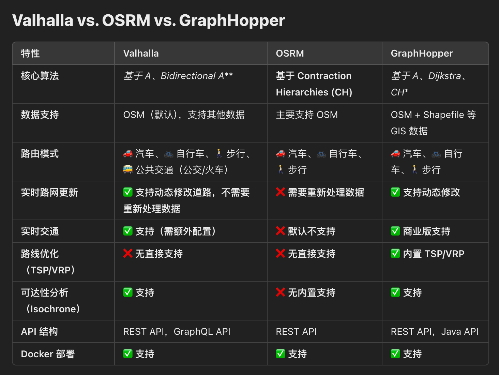

# 开源路由引擎

## [Open Source Routing Machine](https://wiki.openstreetmap.org/wiki/Open_Source_Routing_Machine)

一个高性能的开源路由引擎，用于计算基于 OpenStreetMap (OSM) 数据的最优路径。它采用 C++ 编写，专门针对超快的路径查询进行了优化，能够在毫秒级别返回路由结果，适用于各种应用，如导航、地图服务、物流优化等

Mapbox 早期是基于 OSRM 的，但后来开发了自己的路由引擎 Mapbox Directions，仍然借鉴了 OSRM 的许多思想，并且支持多个后端（包括 OSRM 和其他自定义引擎）

## [graphhopper](https://wiki.openstreetmap.org/wiki/GraphHopper)

适用于更复杂的场景，如动态路网、实时交通、路线优化、多模式交通；OSRM：适用于超快的路径计算，但不支持实时更新或复杂的路径优化

## [Valhalla](https://valhalla.github.io/valhalla/)
开源的路由引擎，类似于 OSRM 和 GraphHopper。它由 Mapzen 开发（后来 Mapzen 被关闭，但 Valhalla 仍然是活跃的开源项目），支持 多模式交通（汽车、步行、自行车、公共交通等），并且提供了动态路网更新、可选的可达性分析、矩阵计算、地图匹配等功能

## [BRouter](https://brouter.de/brouter-web)

专注于自行车和步行路线规划，也支持汽车路径计算。它的特点是高度可定制，用户可以编写自己的路由配置文件，定义不同道路类型的优先级（例如：避开主干道、优先选择自行车道等）

## 为什么要自建路径引擎

* 成本优势；商业 API 规模越大成本越高，开源路由引擎除了服务器运维成本，无需为 API 调用付费
* 具备数据自主权，能完全控制数据；商业 API 无法完全掌控数据，存在限制，无法自主添加路网数据；开源引擎能使用自定义数据，能进行数据融合，不受依赖影响
* 灵活性 & 可定制化；开源路由引擎允许你完全控制路径计算规则，比如能够依据路面情况进行路径规划，同时商业 API 有功能局限性，要扩展满足个性化需求，比较困难，比如：规划一条 10 公里往返路线
* 能离线部署；在户外场景下，需要 APP 离线，甚至在嵌入式设备上部署离线路径引擎

## 商业 API 的优势
* 开发成本低，能快速集成
* 商业 API 一般数据全且丰富，当然户外场景例外
* 实时交通数据
* 强大的 POI（兴趣点）

 

