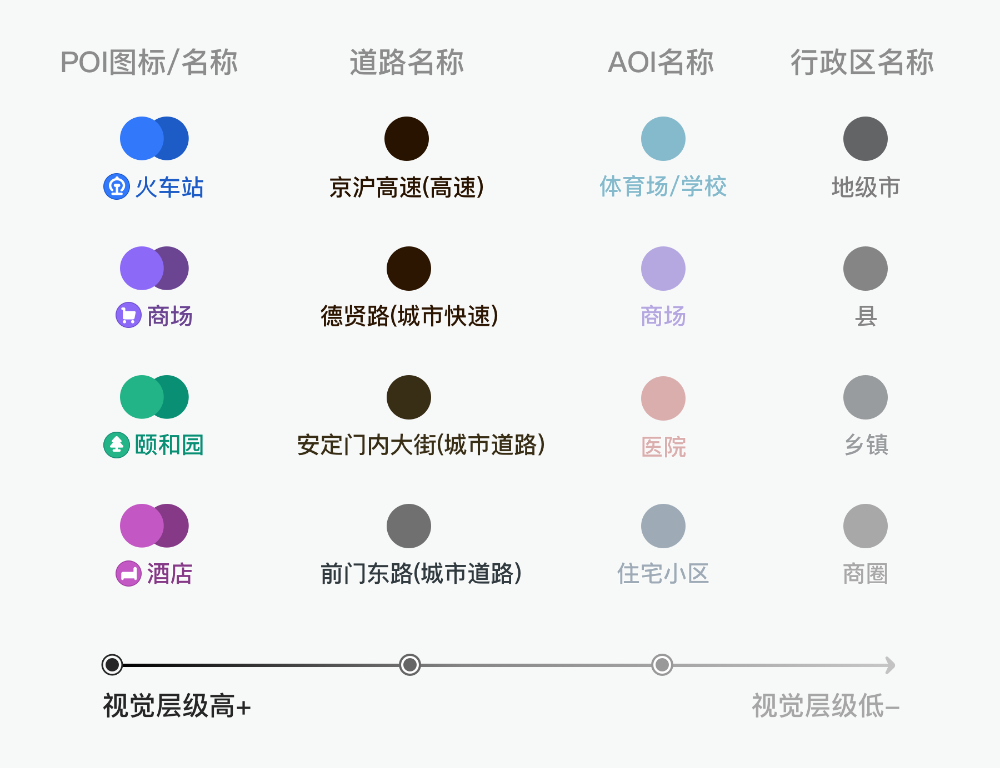

# 地图设计

## [现实世界的画布——解读地图设计（上）](https://www.zcool.com.cn/article/ZMTE4Njg0OA==.html)

* 电子地图优势显著：更新速度快、获取信息效率高、更清晰、可交互等
* 地图数据量非常庞大，无法全部展示，需要结合不同的场景及用户需求，有重点的呈现
* 设计原则
  - 符合制图学和公众认知
  - 保证识别度
  - 清晰有层次
     - 信息主次清晰: 同类元素有关联性，不同元素有差异性。信息主次也会根据比例尺的变化有所调整
     - 视觉具有整体性：既要保证地图中各元素之间的区隔度，又要保证地图整体与其他业务组件拉开视觉层级
  - 细分地图模式
  - 具有品牌特性

## [现实世界的画布——解读地图设计（下）](https://www.zcool.com.cn/article/ZMTE5MjIwNA==.html)

* **用户需求及习惯表明**：在首页主要是明确自身定位、查看其他位置信息，且视距基本是手持距离。那么“构建适合自驾场景的浏览地图”关键点就在于识别度，更好的展示重点信息，保证用户读图效率。

## [设计师的角度分析产品改版-高德地图_10.0.3](https://www.zcool.com.cn/article/ZMTAxOTA3Ng==.html)

* 底部上拉式背板
  - 符合我们的手势操作规律及拟物原则，交互方式一目了然
* 分段式选择不好

## [车载地图交互](https://www.zcool.com.cn/article/ZMTU5OTMzMg==.html)

* 车载核心场景就是「在开车」，驾驶的这个场景势必最终都会引导到一个最最最核心的点：安全第一！ 因为驾驶中，司机无法在屏幕上持续专注 3s 以上，所以基于「安全性」和「无法长时间看屏幕」=>「减少注意力分散」
* 「定位」「流畅性」「数据更新速度」
* 「易操作性」、「界面简洁清晰」「高效性」、「反馈清晰」